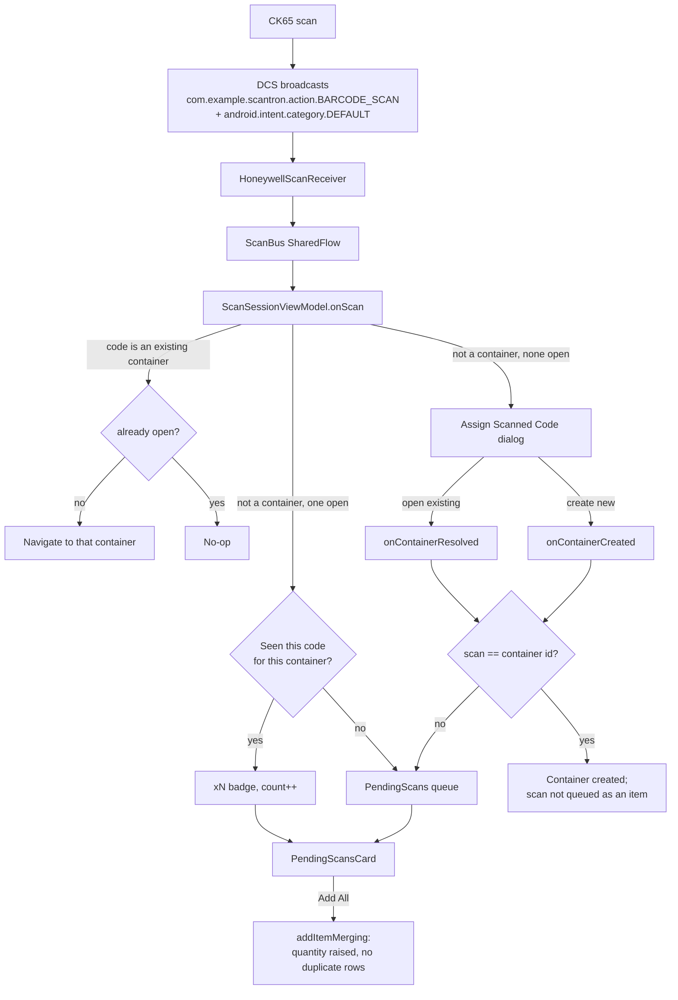

# Scantron Container Inventory

**Scantron Container Inventory** is an Android application for physical container tracking,
warehouse inventory management, and cross-container item search. It is built for enterprise
handheld mobile computers — primarily the **Honeywell CK65** — and degrades gracefully to
ordinary consumer phones.

Scans reach the app through Honeywell's **Data Intent** broadcast system, so there is **no
Honeywell SDK or IntentAPI dependency** — just a `BroadcastReceiver` and the manifest
permission that unlocks it.

---

## 📑 Table of Contents

1. [Quick start](#-quick-start)
2. [CK65 device setup](#-ck65-device-setup) — **required before scanning works**
3. [How scanning works](#-how-scanning-works)
4. [Item merging rules](#-item-merging-rules)
5. [Feature overview](#-feature-overview)
6. [Architecture](#-architecture)
7. [Project structure](#-project-structure)
8. [Database schema](#-database-schema)
9. [Tech stack](#-tech-stack)
10. [Building, running and testing](#-building-running-and-testing)
11. [Troubleshooting](#-troubleshooting)
12. [License](#-license)

---

## 🚀 Quick start

```bash
git clone <your-repo-url> scantron
cd scantron
./gradlew assembleDebug
./gradlew installDebug
```

The app runs on any Android 7.0+ device. **Barcode scanning requires the Honeywell Data
Collection Service**, which ships with CK65 firmware — so on a plain phone, use the on-screen
keyboard via the *Add Item* FAB or the *Scan / Lookup* field.

> ⚠️ **Scanning on a CK65 does nothing until the device is configured.** See
> [CK65 device setup](#-ck65-device-setup).

---

## ⚙️ CK65 device setup

This is a **one-time configuration on the handheld**. The app cannot receive anything until it
is done.

1. `Settings > Honeywell Settings > Scanning > Internal Scanner > Default Profile > Data Processing Settings`
2. Enable **Data Intent**
3. Set **Data Intent Action** to:

   ```
   com.example.scantron.action.BARCODE_SCAN
   ```

4. Set **Category** to:

   ```
   android.intent.category.DEFAULT
   ```

5. Leave **Package Name**, **Class Name** and **Extra Key** blank.

> [!IMPORTANT]
> **Category is not optional.** Action and Category must both be set. Because the Data
> Collection Service sends a *broadcast* (not an activity start), Android does **not**
> auto-append `CATEGORY_DEFAULT` — the value is pure string matching against the app's
> `IntentFilter`. If the device and app disagree, the broadcast silently does not arrive.

> [!TIP]
> Do **not** leave the virtual wedge enabled in the same profile. If the wedge types into the
> *Scan / Lookup* field *and* the Data Intent broadcast is delivered, every scan registers twice.

> [!NOTE]
> Leaving **Extra Key** blank gives you the default extras:
> `data`, `dataBytes`, `charset`, `codeId`, `aimId`, `timestamp`, `version`.
> Setting a custom Extra Key remaps them — the app reads the defaults, so leave it blank.

### Permission

The app declares the Honeywell decode permission in its manifest:

```xml
<uses-permission android:name="com.honeywell.decode.permission.DECODE" />
```

There is no runtime permission prompt and no SDK to initialise.

---

## 🔍 How scanning works



### Classification rules

Every scan is classified before anything happens to it:

| Scanned code | Result |
| :--- | :--- |
| **Identifies an existing container** | Navigates straight into that container. Never queued as an item, so **a container can never end up inside itself**. Re-scanning the container already on screen is a no-op. |
| Not a container, **a container is open** | Queued in the *Scanned Items* card. Nothing is written to the database until you confirm. |
| Not a container, **nothing is open** | The **Assign Scanned Code** dialog asks where it goes. You can open an existing container or create a new one. |

The classification performs a database lookup before deciding, so the whole decision runs under
a `Mutex` — a burst of rapid scans cannot interleave and mis-route.

### The pending queue

Scans accumulate in a *Scanned Items* card on the container detail screen:

- Scanning the **same code repeatedly increments one row** rather than adding duplicates.
- A row scanned more than once shows an **`xN` badge**; the badge is hidden at `N = 1`.
- The header shows total units and, when they differ, the number of distinct codes —
  e.g. *Scanned Items (4 in 2 codes)*.
- **Add All (n)** commits every queued code. **X** removes one entry, **Discard** clears them all.
- Nothing reaches the database until you confirm, so a misfire costs nothing.

---

## 📦 Item merging rules

Adding the same thing twice raises one row's quantity instead of creating a duplicate. A single
function, [`ContainerRepository.addItemMerging`](app/src/main/java/com/example/scantron/data/ContainerRepository.kt),
implements this for **both** entry points — hardware scans and the *Add Item* dialog.

1. **Match by barcode** when the incoming item carries one.
2. **Otherwise match by name**, but only against an item that has **no barcode of its own**
   (case- and whitespace-insensitive). This is what lets name-only items accumulate, since they
   have nothing scannable to identify them by — the identifier has to be typed.
3. On a match, only `quantity` and `updatedAt` change. **`id`, `name`, `category` and `notes`
   survive**, so re-adding an item never clobbers its details.

> [!IMPORTANT]
> An item that **already carries a barcode** is never matched by name. That barcode is its
> identity — merging by name would silently conflate two different barcodes into one row.

> [!NOTE]
> **Editing** an item (`DetailViewModel.saveItem`) writes the row as given and never merges.
> Only *adding* merges; editing must not silently change a quantity.

---

## 🌟 Feature overview

### 🏷️ Container lookup

- **Instant tag search** — scan or type a container tag (`BOX-101`, `BIN-05`, …).
- **Hardware wedge intercept** — `Enter` / `Tab` from a hardware scanner engine opens the
  container with zero taps.
- **Auto-creation** — a new tag provisions a container shell ready for item entry.
- **Quantity-accurate counts** — the list chip shows total **units**, not distinct rows, so a
  container holding one line of *Screws, qty 12* reads **12 items**.

### 📦 Inventory management

- Container metadata: tag, friendly name, location, notes.
- Items with name, optional barcode/SKU, quantity, category and notes.
- **In-place quantity adjustment** with `−` / `+` on every item card.
- **Quantity totals in context** — the detail header reads *2 items (3 total)*.

### 🔍 Cross-container search

- Search every container by item name, category, notes or barcode.
- Results badge the physical container tag each item lives in.
- Tapping a result jumps straight to that container.

### 📤 Import / export

- **Export Inventory** and **Import Inventory** in the containers overflow menu, via the
  system document picker. `scantron_inventory.json`.

### 📡 LAN transfer

Inventory moves in **both** directions, because the person at the desk with a merged document is not
always the person holding the scanner. Each side hosts the direction it is better suited to: this app
connects to the desktop for the usual transfers, and listens for the one case where the desktop
initiates.

| Direction | Transport | What to do |
| :--- | :--- | :--- |
| This device → desktop | `POST :8756/push` | **Send to desktop** |
| Desktop → this device | `GET :8756/pull` | **Get from desktop** — destructive, confirms first |
| Desktop → this device | `POST :8758/receive` | **Receive from desktop**, then confirm |

**Send to desktop** and **Get from desktop** use the desktop's hub on port 8756; type its address into
the field at the top. **Find desktops** can fill it in for you where location access is granted.

**Receive from desktop** is the reverse direction, for when someone at the desk presses *Send to
handheld* and the scanner is somewhere on the same network. Press it and leave this screen open — the
listener binds `0.0.0.0:8758` while it is on and **nothing is open otherwise**, because a listening
socket on a shared warehouse network is a way for any device on it to push a document at this scanner.
The port and this device's address are shown on screen for the operator to copy into the PC.

A document arriving from the desktop is **staged and confirmed, never imported on arrival**. It shares
the confirmation dialog with *Get from desktop*, because the consequence is identical: both clear and
replace the whole database. Anything that cannot be read is refused with a plain-text reason the
desktop shows to whoever sent it.

Bodies on every route are the **raw export document** — no envelope, no base64 — so a document that
arrived over Wi-Fi and the same document on a USB stick are interchangeable.

### 🏭 Handheld optimisations

- Tuned for the CK65's 4.0″ WVGA (480 × 800) display and physical keypad.
- Dense card layouts; 48dp+ touch targets for gloved-hand operation.
- Edge-to-edge with `imePadding()`, so the soft keyboard never covers inputs.
- Long barcodes ellipsize rather than pushing controls off screen.

---

## 🏗️ Architecture

- **MVVM** with `StateFlow` throughout; `ViewModelProvider.Factory` for construction.
- **Unidirectional data flow**: `BroadcastReceiver → ScanBus → ScanSessionViewModel → Compose`.
- The scan **receiver is registered dynamically**, not declared in the manifest. Implicit
  broadcast restrictions on API 26+ apply to manifest entries but not to context-registered
  receivers. `ContextCompat.registerReceiver` with `RECEIVER_EXPORTED` is used because the
  broadcast originates in another process.
- **Room** is the single source of truth; `Flow`-returning DAO queries drive the UI.

---

## 📁 Project structure

```
app/src/main/java/com/example/scantron/
├── MainActivity.kt              Receiver registration, navigation graph, scan collection
├── ScantronApplication.kt       Owns the database and repository
├── scanner/
│   ├── ScanEvent.kt             Decoded scan value object + DCS extra parsing
│   ├── ScanBus.kt               Process-wide SharedFlow between receiver and UI
│   ├── HoneywellScanReceiver.kt BroadcastReceiver for Data Intent scans
│   └── ScanSessionViewModel.kt  Classification, pending queue, commit
├── data/
│   ├── Container.kt             Entity
│   ├── ContainerItem.kt         Entity
│   ├── AppDatabase.kt           Room database + migrations
│   ├── ContainerDao.kt
│   ├── ItemDao.kt               Includes total-quantity and merge lookups
│   ├── ContainerRepository.kt   addItemMerging() lives here
│   └── ExportImportManager.kt   JSON import / export
├── transfer/
│   ├── TransferClient.kt        HTTP to the desktop hub (:8756)
│   ├── TransferListener.kt      HTTP listener for a desktop push (:8758)
│   ├── Discovery.kt             UDP broadcast to find desktops
│   ├── Peer.kt                  Discovery reply value object
│   └── DeviceInfo.kt            This device's own addresses, for display
└── ui/
    ├── components/              EditContainerDialog, EditItemDialog,
    │                            OpenOrCreateContainerDialog
    ├── lookup/                  Containers list, Scan/Lookup screen
    ├── detail/                  Container detail, PendingScansCard
    ├── search/                  Cross-container search
    ├── navigation/              Routes and URI encoding
    └── theme/
```

---

## 🗄️ Database schema

### `containers`

| Column | Type | Description |
| :--- | :--- | :--- |
| `id` (PK) | `TEXT` | Container tag/code (e.g. `BOX-101`) |
| `name` | `TEXT` | Optional friendly label |
| `location` | `TEXT` | Physical location (e.g. `Shelf 2-A`) |
| `notes` | `TEXT` | Free-form details |
| `updatedAt` | `INTEGER` | Epoch millis |

### `container_items`

| Column | Type | Description |
| :--- | :--- | :--- |
| `id` (PK) | `INTEGER` | Auto-generated |
| `containerId` (FK) | `TEXT` | → `containers(id)`, `ON DELETE CASCADE` |
| `name` | `TEXT` | Item name |
| `barcode` | `TEXT` | Optional barcode / SKU / UPC |
| `quantity` | `INTEGER` | Units in stock |
| `category` | `TEXT` | Category tag |
| `notes` | `TEXT` | Description / serial numbers |
| `updatedAt` | `INTEGER` | Epoch millis |

Indexed on `containerId` and `barcode`. Schema version 2, with `MIGRATION_1_2` adding the
barcode column and its index.

### Notable queries

```kotlin
// Total units, not rows. COALESCE is required: SUM over no rows yields NULL,
// which does not map onto a non-null Int and would crash on an empty container.
@Query("SELECT COALESCE(SUM(quantity), 0) FROM container_items WHERE containerId = :containerId")
fun getTotalQuantityForContainer(containerId: String): Flow<Int>

// Merge target 1: an item already carrying this barcode.
@Query("SELECT * FROM container_items WHERE containerId = :containerId AND TRIM(barcode) = TRIM(:barcode) LIMIT 1")
suspend fun getItemByBarcode(containerId: String, barcode: String): ContainerItem?

// Merge target 2: a barcode-less item with this name.
@Query("SELECT * FROM container_items WHERE containerId = :containerId AND TRIM(barcode) = '' AND LOWER(TRIM(name)) = LOWER(TRIM(:name)) LIMIT 1")
suspend fun getNameOnlyItemByName(containerId: String, name: String): ContainerItem?
```

---

## 🔧 Tech stack

| | |
| :--- | :--- |
| Language | Kotlin 2.0.21 |
| UI | Jetpack Compose, Material 3 |
| Database | Room 2.6.1 (KSP) |
| Navigation | Navigation Compose |
| Async | Coroutines / Flow |
| min / target / compile SDK | 24 / 33 / 34 |
| JDK | 17 |
| AGP | 8.13.2 |

No Honeywell dependency of any kind — the integration is a broadcast and a permission string.

---

## 🛠️ Building, running and testing

```bash
./gradlew assembleDebug          # build
./gradlew installDebug           # install on a connected device
./gradlew testDebugUnitTest      # unit tests
./gradlew lintDebug              # lint
```

Tests are Robolectric-based and run against an in-memory Room database, so **no hardware is
needed**:

> **Run the tests on a JDK 17 or 21, not a JRE and not a bare JDK 25.** Robolectric 4.13 fails at
> setup on a newer runtime with `ClassNotFoundException: couldn't load android.webkit.RoboCookieManager`
> — and because the failure is in the harness rather than in any test, it reports as every test in the
> suite failing at once. Point `JAVA_HOME` at a 17 or 21 JDK, e.g.
> `JAVA_HOME=~/.jdks/jbr-21.0.11 ./gradlew testDebugUnitTest`.

| Suite | Covers |
| :--- | :--- |
| `HoneywellScanReceiverTest` | DCS extra parsing, trimming, null handling, wrong-action and blank-payload rejection, ordered burst delivery |
| `ScanSessionViewModelTest` | Scan classification, navigation, the pending queue and its merging rules, commit-to-database behaviour, name-only items |
| `ContainerQuantityTest` | Empty containers, quantity summing, per-container isolation |
| `TransferClientTest` | The desktop contract over a real socket: route, exact push bytes, plain-text refusals, refused connections |
| `TransferListenerTest` | A desktop push arriving over a real socket: staged and counted, unreadable and empty bodies refused, wrong route, bind refusal, port release |

### Simulating a scan without a scanner

The app's receiver can be driven from `adb`, using the exact action, category and extras the
DCS sends:

```bash
adb shell am broadcast \
  -a com.example.scantron.action.BARCODE_SCAN \
  -c android.intent.category.DEFAULT \
  -p com.example.scantron \
  --es data "BOX-101" \
  --es codeId "C" \
  --es aimId "]C1"
```

Watch the log:

```bash
adb logcat -s HoneywellScanReceiver
```

---

## 🩺 Troubleshooting

**Scanning does nothing; no dialog appears, no log output.**

Work through these in order — the failure is silent by design.

| Check | How |
| :--- | :--- |
| Data Intent enabled? | Settings path above. |
| Action matches exactly? | Must equal `com.example.scantron.action.BARCODE_SCAN`. |
| **Category matches?** | Must equal `android.intent.category.DEFAULT`. A mismatch drops the broadcast with no error. |
| Package / Class left blank? | They must be empty — the app relies on an implicit broadcast. |
| App in the foreground? | The receiver is unregistered in `onDestroy`. |
| Permission declared? | Check `com.honeywell.decode.permission.DECODE` is in the manifest. |
| Wedge double-input? | A scan arriving twice means the virtual wedge is also typing. Disable one path. |

**A container will not open from its tag.** Confirm the tag matches a `containers.id` exactly —
matching is case- and whitespace-insensitive, so `box-101` resolves to `BOX-101`, but a
trailing character will not.

**The desktop's "Send to handheld" cannot reach this scanner.**
The socket only exists while **Receive from desktop** is showing "Listening" on this screen — it
closes when the screen goes away, which is deliberate. Confirm both devices are on the same Wi-Fi,
that the desktop has this device's address (shown under *This device*) rather than the desktop's own,
and that port 8758 is not blocked between them. Watch `adb logcat -s TransferListener` for the bind
result and each staged push.

**"Could not listen on port 8758".**
Another process already holds it — usually a second copy of this screen left open. Close it and press
the button again; the bind is retried on every press rather than being latched as failed.

**Scans are merging when they should not.** Two codes differing only by case or surrounding
whitespace are treated as the same item by design, so that decoder-appended newlines do not
create duplicates.

---

## 📄 License

This project is licensed under the MIT License.